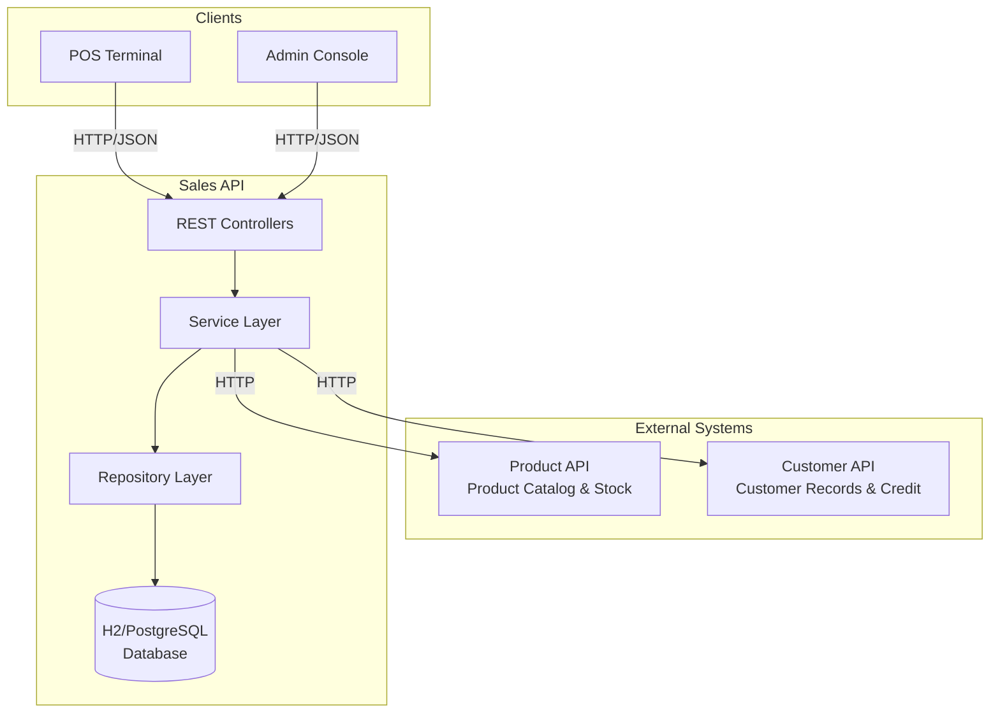
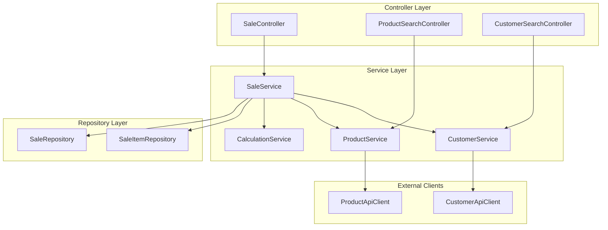
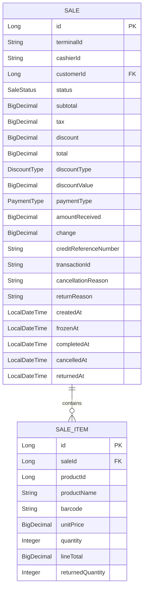

# Design Document: Sales API for Supermarket POS System

## Overview

The Sales API is a RESTful web service built with Spring Boot 3.x that manages sales transactions for a supermarket Point of Sale (POS) system. The API handles the complete sales lifecycle including product and customer search, sale creation, item management, multiple payment types (cash and credit), checkout processing, sale freezing, cancellations, and returns (both full and partial).

The Sales API acts as an orchestration layer that integrates with two external services:
- **Product API**: Provides product catalog, stock levels, and pricing information
- **Customer API**: Provides customer records and credit status validation

This design follows a layered architecture pattern with clear separation of concerns, uses Spring Data JPA for persistence, and implements comprehensive error handling and validation strategies.

### Key Design Principles

1. **Layered Architecture**: Clear separation between Controller, Service, and Repository layers
2. **Domain-Driven Design**: Rich domain model with business logic encapsulated in entities
3. **External Integration**: Resilient integration with external APIs using RestTemplate with proper error handling
4. **Precision Arithmetic**: BigDecimal for all monetary calculations to avoid floating-point errors
5. **State Machine**: Well-defined sale lifecycle with validated state transitions
6. **Testability**: Design supports comprehensive unit and integration testing with mocked external dependencies

## Architecture

### System Context Diagram



### Layered Architecture

The application follows a three-tier layered architecture:

**1. Controller Layer (Presentation)**
- Handles HTTP requests and responses
- Performs input validation using Jakarta Bean Validation
- Maps DTOs to domain models and vice versa
- Returns appropriate HTTP status codes
- Delegates business logic to the service layer

**2. Service Layer (Business Logic)**
- Implements all business rules and workflows
- Orchestrates operations across multiple repositories
- Integrates with external APIs (Product API, Customer API)
- Manages transactions
- Performs state validation and transitions
- Calculates sale totals and monetary values

**3. Repository Layer (Data Access)**
- Provides CRUD operations using Spring Data JPA
- Defines custom queries for complex data retrieval
- Abstracts database operations from business logic

### Component Diagram



## Components and Interfaces

### REST API Endpoints

#### Product Search Endpoints

**GET /api/v1/products/search/by-name**
- Query Parameter: `name` (String, required)
- Response: `200 OK` with `List<ProductDTO>`
- Error: `503 Service Unavailable` if Product API is down

**GET /api/v1/products/search/by-barcode**
- Query Parameter: `barcode` (String, required)
- Response: `200 OK` with `ProductDTO`
- Error: `404 Not Found` if product not found
- Error: `503 Service Unavailable` if Product API is down

#### Customer Search Endpoints

**GET /api/v1/customers/search/by-name**
- Query Parameter: `name` (String, required)
- Response: `200 OK` with `List<CustomerDTO>`
- Error: `503 Service Unavailable` if Customer API is down

**GET /api/v1/customers/search/by-document**
- Query Parameter: `documentNumber` (String, required)
- Response: `200 OK` with `CustomerDTO`
- Error: `404 Not Found` if customer not found
- Error: `503 Service Unavailable` if Customer API is down

#### Sale Management Endpoints

**POST /api/v1/sales**
- Request Body: `CreateSaleRequest` (terminalId, cashierId, customerId optional)
- Response: `201 Created` with `SaleDTO`
- Error: `400 Bad Request` for validation errors

**GET /api/v1/sales/{saleId}**
- Path Variable: `saleId` (Long, required)
- Response: `200 OK` with `SaleDTO`
- Error: `404 Not Found` if sale not found

**GET /api/v1/sales/terminal/{terminalId}**
- Path Variable: `terminalId` (String, required)
- Query Parameters: `status` (optional), `startDate` (optional), `endDate` (optional)
- Response: `200 OK` with `List<SaleDTO>`

**GET /api/v1/sales/terminal/{terminalId}/frozen**
- Path Variable: `terminalId` (String, required)
- Response: `200 OK` with `List<FrozenSaleDTO>`

#### Sale Item Management Endpoints

**POST /api/v1/sales/{saleId}/items/by-product-id**
- Path Variable: `saleId` (Long, required)
- Request Body: `AddItemByProductIdRequest` (productId, quantity)
- Response: `200 OK` with `SaleDTO`
- Error: `404 Not Found` if sale or product not found
- Error: `409 Conflict` if insufficient stock or sale not active

**POST /api/v1/sales/{saleId}/items/by-barcode**
- Path Variable: `saleId` (Long, required)
- Request Body: `AddItemByBarcodeRequest` (barcode, quantity)
- Response: `200 OK` with `SaleDTO`
- Error: `404 Not Found` if sale or product not found
- Error: `409 Conflict` if insufficient stock or sale not active

**PUT /api/v1/sales/{saleId}/items/{itemId}/quantity**
- Path Variables: `saleId` (Long), `itemId` (Long)
- Request Body: `UpdateQuantityRequest` (quantity)
- Response: `200 OK` with `SaleDTO`
- Error: `404 Not Found` if sale or item not found
- Error: `409 Conflict` if insufficient stock or sale not active

**DELETE /api/v1/sales/{saleId}/items/{itemId}**
- Path Variables: `saleId` (Long), `itemId` (Long)
- Response: `200 OK` with `SaleDTO`
- Error: `404 Not Found` if sale or item not found
- Error: `409 Conflict` if sale not active

#### Sale Operations Endpoints

**POST /api/v1/sales/{saleId}/discount**
- Path Variable: `saleId` (Long, required)
- Request Body: `ApplyDiscountRequest` (discountType, discountValue)
- Response: `200 OK` with `SaleDTO`
- Error: `400 Bad Request` for invalid discount values
- Error: `409 Conflict` if sale not active

**POST /api/v1/sales/{saleId}/checkout**
- Path Variable: `saleId` (Long, required)
- Request Body: `CheckoutRequest` (paymentType, amountReceived for cash, customerId for credit)
- Response: `200 OK` with `CheckoutResponse` (sale, receipt)
- Error: `400 Bad Request` for validation errors
- Error: `409 Conflict` if sale not active or insufficient stock
- Error: `422 Unprocessable Entity` for credit validation failures

**POST /api/v1/sales/{saleId}/freeze**
- Path Variable: `saleId` (Long, required)
- Response: `200 OK` with `SaleDTO`
- Error: `409 Conflict` if sale not active

**POST /api/v1/sales/{saleId}/resume**
- Path Variable: `saleId` (Long, required)
- Response: `200 OK` with `SaleDTO`
- Error: `409 Conflict` if sale not frozen

**POST /api/v1/sales/{saleId}/cancel**
- Path Variable: `saleId` (Long, required)
- Request Body: `CancelSaleRequest` (cancellationReason)
- Response: `200 OK` with `SaleDTO`
- Error: `400 Bad Request` if reason invalid
- Error: `409 Conflict` if sale cannot be cancelled

**POST /api/v1/sales/{saleId}/return/full**
- Path Variable: `saleId` (Long, required)
- Request Body: `FullReturnRequest` (returnReason)
- Response: `200 OK` with `ReturnResponse` (sale, returnReceipt, creditNote if applicable)
- Error: `400 Bad Request` if reason missing
- Error: `409 Conflict` if sale not completed or already returned

**POST /api/v1/sales/{saleId}/return/partial**
- Path Variable: `saleId` (Long, required)
- Request Body: `PartialReturnRequest` (returnReason, returnItems with itemId and quantity)
- Response: `200 OK` with `ReturnResponse` (sale, returnReceipt, creditNote if applicable)
- Error: `400 Bad Request` for validation errors
- Error: `409 Conflict` if sale not completed or return quantity invalid

### External API Integration

#### Product API Client

**Interface**: `ProductApiClient`

Methods:
- `List<ProductDTO> searchProductsByName(String name)` - Search products by partial name match
- `ProductDTO searchProductByBarcode(String barcode)` - Find product by exact barcode
- `ProductDTO getProductById(Long productId)` - Retrieve product details by ID
- `void decrementStock(Long productId, Integer quantity)` - Reduce stock after checkout
- `void incrementStock(Long productId, Integer quantity)` - Restore stock after return

Error Handling:
- Throws `ProductServiceUnavailableException` on connection errors or timeouts
- Throws `ProductNotFoundException` when product not found (404)
- Implements retry logic with exponential backoff for transient failures
- Uses circuit breaker pattern to prevent cascading failures

#### Customer API Client

**Interface**: `CustomerApiClient`

Methods:
- `List<CustomerDTO> searchCustomersByName(String name)` - Search customers by partial name match
- `CustomerDTO searchCustomerByDocument(String documentNumber)` - Find customer by exact document number
- `CustomerDTO getCustomerById(Long customerId)` - Retrieve customer details by ID
- `CreditStatus validateCreditStatus(Long customerId)` - Check customer credit approval status

Error Handling:
- Throws `CustomerServiceUnavailableException` on connection errors or timeouts
- Throws `CustomerNotFoundException` when customer not found (404)
- Implements retry logic with exponential backoff for transient failures
- Uses circuit breaker pattern to prevent cascading failures

### Service Layer Components

#### SaleService

Primary service for sale lifecycle management.

**Responsibilities**:
- Create new sales
- Add, update, and remove items from sales
- Apply discounts
- Process checkout for cash and credit payments
- Freeze and resume sales
- Cancel sales
- Process full and partial returns
- Validate state transitions
- Coordinate with external services

**Key Methods**:
- `SaleDTO createSale(CreateSaleRequest request)`
- `SaleDTO addItemByProductId(Long saleId, Long productId, Integer quantity)`
- `SaleDTO addItemByBarcode(Long saleId, String barcode, Integer quantity)`
- `SaleDTO updateItemQuantity(Long saleId, Long itemId, Integer quantity)`
- `SaleDTO removeItem(Long saleId, Long itemId)`
- `SaleDTO applyDiscount(Long saleId, DiscountType type, BigDecimal value)`
- `CheckoutResponse checkout(Long saleId, CheckoutRequest request)`
- `SaleDTO freezeSale(Long saleId)`
- `SaleDTO resumeSale(Long saleId)`
- `SaleDTO cancelSale(Long saleId, String reason)`
- `ReturnResponse processFullReturn(Long saleId, String reason)`
- `ReturnResponse processPartialReturn(Long saleId, PartialReturnRequest request)`
- `SaleDTO getSaleById(Long saleId)`
- `List<SaleDTO> getSalesByTerminal(String terminalId, SaleStatus status, LocalDate startDate, LocalDate endDate)`
- `List<FrozenSaleDTO> getFrozenSalesByTerminal(String terminalId)`

#### CalculationService

Handles all monetary calculations with precision.

**Responsibilities**:
- Calculate line item totals
- Calculate subtotal from all items
- Calculate tax based on configurable rate
- Apply discounts (percentage or fixed amount)
- Calculate final total
- Calculate change for cash payments
- Use BigDecimal with RoundingMode.HALF_UP
- Perform intermediate calculations in cents (integer arithmetic)

**Key Methods**:
- `BigDecimal calculateLineTotal(BigDecimal unitPrice, Integer quantity)`
- `BigDecimal calculateSubtotal(List<SaleItem> items)`
- `BigDecimal calculateTax(BigDecimal subtotal, BigDecimal taxRate)`
- `BigDecimal calculateDiscountAmount(BigDecimal subtotal, DiscountType type, BigDecimal value)`
- `BigDecimal calculateTotal(BigDecimal subtotal, BigDecimal tax, BigDecimal discount)`
- `BigDecimal calculateChange(BigDecimal total, BigDecimal amountReceived)`
- `void recalculateSaleTotals(Sale sale)`

#### ProductService

Facade for Product API integration.

**Responsibilities**:
- Search products by name or barcode
- Retrieve product details
- Validate stock availability
- Decrement stock on checkout
- Increment stock on returns
- Handle Product API errors gracefully

**Key Methods**:
- `List<ProductDTO> searchByName(String name)`
- `ProductDTO searchByBarcode(String barcode)`
- `ProductDTO getById(Long productId)`
- `void validateStockAvailability(Long productId, Integer requestedQuantity)`
- `void decrementStock(Long productId, Integer quantity)`
- `void incrementStock(Long productId, Integer quantity)`

#### CustomerService

Facade for Customer API integration.

**Responsibilities**:
- Search customers by name or document
- Retrieve customer details
- Validate credit status for credit sales
- Handle Customer API errors gracefully

**Key Methods**:
- `List<CustomerDTO> searchByName(String name)`
- `CustomerDTO searchByDocument(String documentNumber)`
- `CustomerDTO getById(Long customerId)`
- `void validateCreditApproval(Long customerId)`

## Data Models

### Entity Relationship Diagram



### Core Entities

#### Sale Entity

Represents a sales transaction with complete lifecycle tracking.

**Table**: `sales`

**Fields**:
- `id` (Long, PK, Auto-generated): Unique sale identifier
- `terminalId` (String, NOT NULL): POS terminal identifier
- `cashierId` (String, NOT NULL): Cashier identifier
- `customerId` (Long, NULLABLE): Associated customer ID (required for credit sales)
- `status` (SaleStatus enum, NOT NULL): Current sale state
- `subtotal` (BigDecimal, NOT NULL, default 0.00): Sum of all line items
- `tax` (BigDecimal, NOT NULL, default 0.00): Calculated tax amount
- `discount` (BigDecimal, NOT NULL, default 0.00): Applied discount amount
- `total` (BigDecimal, NOT NULL, default 0.00): Final amount to pay
- `discountType` (DiscountType enum, NULLABLE): PERCENTAGE or FIXED_AMOUNT
- `discountValue` (BigDecimal, NULLABLE): Discount percentage or fixed amount
- `paymentType` (PaymentType enum, NULLABLE): CASH or CREDIT (set on checkout)
- `amountReceived` (BigDecimal, NULLABLE): Cash amount received (cash sales only)
- `change` (BigDecimal, NULLABLE): Change returned (cash sales only)
- `creditReferenceNumber` (String, NULLABLE): Credit transaction reference (credit sales only)
- `transactionId` (String, NULLABLE): Unique transaction ID (set on checkout)
- `cancellationReason` (String, NULLABLE, max 255): Reason for cancellation
- `returnReason` (String, NULLABLE): Reason for return
- `createdAt` (LocalDateTime, NOT NULL): Sale creation timestamp
- `frozenAt` (LocalDateTime, NULLABLE): Freeze timestamp
- `completedAt` (LocalDateTime, NULLABLE): Checkout completion timestamp
- `cancelledAt` (LocalDateTime, NULLABLE): Cancellation timestamp
- `returnedAt` (LocalDateTime, NULLABLE): Return processing timestamp

**Relationships**:
- One-to-Many with SaleItem (cascade ALL, orphan removal)

**Indexes**:
- `idx_sale_terminal_status` on (terminalId, status)
- `idx_sale_terminal_created` on (terminalId, createdAt)
- `idx_sale_transaction_id` on (transactionId) - unique

**Business Methods**:
- `void addItem(SaleItem item)`: Add item and recalculate totals
- `void removeItem(SaleItem item)`: Remove item and recalculate totals
- `void updateItemQuantity(SaleItem item, Integer newQuantity)`: Update quantity and recalculate
- `void applyDiscount(DiscountType type, BigDecimal value)`: Apply discount and recalculate
- `void freeze()`: Transition to FROZEN state with validation
- `void resume()`: Transition back to ACTIVE state with validation
- `void cancel(String reason)`: Transition to CANCELLED state with validation
- `void complete(PaymentType paymentType)`: Transition to COMPLETED state with validation
- `void markAsReturned()`: Transition to RETURNED state with validation
- `void markAsPartiallyReturned()`: Transition to PARTIALLY_RETURNED state with validation
- `boolean canAddItems()`: Check if sale is in ACTIVE state
- `boolean canCheckout()`: Check if sale has items and is ACTIVE
- `boolean canFreeze()`: Check if sale is ACTIVE
- `boolean canResume()`: Check if sale is FROZEN
- `boolean canCancel()`: Check if sale is ACTIVE or FROZEN
- `boolean canReturn()`: Check if sale is COMPLETED or PARTIALLY_RETURNED

#### SaleItem Entity

Represents a line item in a sale with product snapshot.

**Table**: `sale_items`

**Fields**:
- `id` (Long, PK, Auto-generated): Unique item identifier
- `saleId` (Long, FK, NOT NULL): Reference to parent sale
- `productId` (Long, NOT NULL): Product identifier from Product API
- `productName` (String, NOT NULL): Product name snapshot
- `barcode` (String, NOT NULL): Product barcode snapshot
- `unitPrice` (BigDecimal, NOT NULL): Unit price snapshot at time of adding
- `quantity` (Integer, NOT NULL): Quantity purchased
- `lineTotal` (BigDecimal, NOT NULL): Calculated as unitPrice × quantity
- `returnedQuantity` (Integer, NOT NULL, default 0): Quantity returned (for partial returns)

**Relationships**:
- Many-to-One with Sale

**Indexes**:
- `idx_sale_item_sale_id` on (saleId)
- `idx_sale_item_product_id` on (productId)

**Business Methods**:
- `void updateQuantity(Integer newQuantity)`: Update quantity and recalculate line total
- `void calculateLineTotal()`: Recalculate lineTotal as unitPrice × quantity
- `Integer getAvailableForReturn()`: Return quantity - returnedQuantity
- `void incrementReturnedQuantity(Integer amount)`: Track partial returns

### Enumerations

#### SaleStatus

Represents the lifecycle state of a sale.

**Values**:
- `ACTIVE`: Sale is being built, items can be added/removed
- `FROZEN`: Sale is temporarily paused
- `COMPLETED`: Sale has been checked out successfully
- `CANCELLED`: Sale was cancelled before checkout
- `RETURNED`: All items have been returned
- `PARTIALLY_RETURNED`: Some items have been returned

**State Transition Rules**:
```
ACTIVE → FROZEN (freeze)
ACTIVE → COMPLETED (checkout)
ACTIVE → CANCELLED (cancel)
FROZEN → ACTIVE (resume)
FROZEN → CANCELLED (cancel)
COMPLETED → RETURNED (full return)
COMPLETED → PARTIALLY_RETURNED (partial return)
PARTIALLY_RETURNED → RETURNED (return remaining items)
```

#### PaymentType

Represents the payment method used for a sale.

**Values**:
- `CASH`: Cash payment with change calculation
- `CREDIT`: Credit payment requiring customer and credit approval

#### DiscountType

Represents the type of discount applied to a sale.

**Values**:
- `PERCENTAGE`: Discount as percentage of subtotal (0-100)
- `FIXED_AMOUNT`: Discount as fixed monetary amount

#### CreditStatus

Represents customer credit approval status (from Customer API).

**Values**:
- `APPROVED`: Customer approved for credit purchases
- `REJECTED`: Customer not approved for credit
- `PENDING`: Credit approval pending review

### Data Transfer Objects (DTOs)

#### ProductDTO

External data from Product API.

**Fields**:
- `id` (Long): Product identifier
- `name` (String): Product name
- `barcode` (String): Product barcode
- `unitPrice` (BigDecimal): Current unit price
- `availableStock` (Integer): Available quantity in stock
- `category` (String): Product category

#### CustomerDTO

External data from Customer API.

**Fields**:
- `id` (Long): Customer identifier
- `fullName` (String): Customer full name
- `documentType` (String): Document type (e.g., "DNI", "RUC")
- `documentNumber` (String): Document number
- `creditStatus` (CreditStatus): Credit approval status

#### SaleDTO

Sale data for API responses.

**Fields**:
- `id` (Long): Sale identifier
- `terminalId` (String): Terminal identifier
- `cashierId` (String): Cashier identifier
- `customerId` (Long, nullable): Customer identifier
- `status` (SaleStatus): Current status
- `items` (List<SaleItemDTO>): List of sale items
- `subtotal` (BigDecimal): Subtotal amount
- `tax` (BigDecimal): Tax amount
- `discount` (BigDecimal): Discount amount
- `total` (BigDecimal): Total amount
- `discountType` (DiscountType, nullable): Discount type
- `discountValue` (BigDecimal, nullable): Discount value
- `paymentType` (PaymentType, nullable): Payment type
- `amountReceived` (BigDecimal, nullable): Amount received (cash)
- `change` (BigDecimal, nullable): Change returned (cash)
- `creditReferenceNumber` (String, nullable): Credit reference
- `transactionId` (String, nullable): Transaction ID
- `createdAt` (LocalDateTime): Creation timestamp
- `completedAt` (LocalDateTime, nullable): Completion timestamp

#### SaleItemDTO

Sale item data for API responses.

**Fields**:
- `id` (Long): Item identifier
- `productId` (Long): Product identifier
- `productName` (String): Product name
- `barcode` (String): Product barcode
- `unitPrice` (BigDecimal): Unit price
- `quantity` (Integer): Quantity
- `lineTotal` (BigDecimal): Line total
- `returnedQuantity` (Integer): Returned quantity

#### ReceiptDTO

Receipt data generated after checkout.

**Fields**:
- `storeName` (String): Store name (from configuration)
- `terminalId` (String): Terminal identifier
- `cashierId` (String): Cashier identifier
- `transactionId` (String): Unique transaction ID
- `timestamp` (LocalDateTime): Transaction timestamp
- `customerInfo` (CustomerDTO, nullable): Customer information if present
- `items` (List<ReceiptItemDTO>): List of purchased items
- `subtotal` (BigDecimal): Subtotal amount
- `tax` (BigDecimal): Tax amount
- `discount` (BigDecimal): Discount amount
- `total` (BigDecimal): Total amount
- `paymentType` (PaymentType): Payment method
- `amountReceived` (BigDecimal, nullable): Amount received (cash)
- `change` (BigDecimal, nullable): Change returned (cash)
- `creditReferenceNumber` (String, nullable): Credit reference (credit)

#### ReturnReceiptDTO

Return receipt data generated after return processing.

**Fields**:
- `originalTransactionId` (String): Original transaction ID
- `returnTimestamp` (LocalDateTime): Return processing timestamp
- `returnReason` (String): Reason for return
- `returnedItems` (List<ReturnedItemDTO>): List of returned items
- `totalRefundAmount` (BigDecimal): Total refund amount
- `creditNoteNumber` (String, nullable): Credit note number (credit sales)

### Request/Response Models

#### CreateSaleRequest

**Fields**:
- `terminalId` (String, @NotBlank): Terminal identifier
- `cashierId` (String, @NotBlank): Cashier identifier
- `customerId` (Long, nullable): Customer identifier

#### AddItemByProductIdRequest

**Fields**:
- `productId` (Long, @NotNull): Product identifier
- `quantity` (Integer, @NotNull, @Min(1)): Quantity to add

#### AddItemByBarcodeRequest

**Fields**:
- `barcode` (String, @NotBlank): Product barcode
- `quantity` (Integer, @NotNull, @Min(1)): Quantity to add

#### UpdateQuantityRequest

**Fields**:
- `quantity` (Integer, @NotNull, @Min(1)): New quantity

#### ApplyDiscountRequest

**Fields**:
- `discountType` (DiscountType, @NotNull): PERCENTAGE or FIXED_AMOUNT
- `discountValue` (BigDecimal, @NotNull, @DecimalMin("0.00")): Discount value

**Validation**:
- If PERCENTAGE: value must be between 0 and 100
- If FIXED_AMOUNT: value must be >= 0

#### CheckoutRequest

**Fields**:
- `paymentType` (PaymentType, @NotNull): CASH or CREDIT
- `amountReceived` (BigDecimal, nullable): Required for CASH payments
- `customerId` (Long, nullable): Required for CREDIT payments

**Validation**:
- If CASH: amountReceived must be provided and >= sale total
- If CREDIT: customerId must be provided

#### CancelSaleRequest

**Fields**:
- `cancellationReason` (String, @NotBlank, @Size(max=255)): Cancellation reason

#### FullReturnRequest

**Fields**:
- `returnReason` (String, @NotBlank): Return reason

#### PartialReturnRequest

**Fields**:
- `returnReason` (String, @NotBlank): Return reason
- `returnItems` (List<ReturnItemRequest>, @NotEmpty): Items to return

#### ReturnItemRequest

**Fields**:
- `itemId` (Long, @NotNull): Sale item identifier
- `quantity` (Integer, @NotNull, @Min(1)): Quantity to return

### Error Response Model

#### ErrorResponse

Standard error response format for all API errors.

**Fields**:
- `timestamp` (LocalDateTime): Error occurrence timestamp
- `status` (Integer): HTTP status code
- `error` (String): Error type (e.g., "Bad Request", "Not Found")
- `message` (String): Human-readable error message
- `path` (String): Request path that caused the error
- `validationErrors` (List<ValidationError>, nullable): Field validation errors

#### ValidationError

Individual field validation error.

**Fields**:
- `field` (String): Field name that failed validation
- `message` (String): Validation error message
- `rejectedValue` (Object, nullable): Value that was rejected

## Error Handling

### Error Handling Strategy

The Sales API implements a comprehensive error handling strategy with consistent error responses, appropriate HTTP status codes, and clear error messages for all failure scenarios.

### Exception Hierarchy

```
RuntimeException
├── BusinessException (base for business rule violations)
│   ├── SaleNotActiveException (409 Conflict)
│   ├── SaleNotFrozenException (409 Conflict)
│   ├── SaleAlreadyCancelledException (409 Conflict)
│   ├── SaleAlreadyReturnedException (409 Conflict)
│   ├── InsufficientStockException (409 Conflict)
│   ├── InvalidDiscountException (400 Bad Request)
│   ├── InvalidPaymentException (400 Bad Request)
│   ├── CreditNotApprovedException (422 Unprocessable Entity)
│   ├── CustomerRequiredException (422 Unprocessable Entity)
│   └── InvalidReturnQuantityException (400 Bad Request)
├── ResourceNotFoundException (404 Not Found)
│   ├── SaleNotFoundException
│   ├── SaleItemNotFoundException
│   ├── ProductNotFoundException
│   └── CustomerNotFoundException
└── ExternalServiceException (503 Service Unavailable)
    ├── ProductServiceUnavailableException
    └── CustomerServiceUnavailableException
```

### Global Exception Handler

**Class**: `GlobalExceptionHandler` (annotated with `@RestControllerAdvice`)

**Responsibilities**:
- Catch all exceptions thrown by controllers and services
- Map exceptions to appropriate HTTP status codes
- Generate consistent ErrorResponse objects
- Log errors for monitoring and debugging

**Exception Mappings**:

| Exception Type | HTTP Status | Error Message Source |
|----------------|-------------|---------------------|
| `MethodArgumentNotValidException` | 400 Bad Request | Validation error details |
| `BusinessException` subclasses | 400/409/422 | Exception message |
| `ResourceNotFoundException` subclasses | 404 Not Found | Exception message |
| `ExternalServiceException` subclasses | 503 Service Unavailable | Exception message |
| `HttpMessageNotReadableException` | 400 Bad Request | "Invalid request format" |
| `HttpRequestMethodNotSupportedException` | 405 Method Not Allowed | "Method not supported" |
| `Exception` (catch-all) | 500 Internal Server Error | "Internal server error" |

### HTTP Status Code Usage

**200 OK**: Successful GET, PUT, DELETE operations
**201 Created**: Successful POST for resource creation (create sale)
**400 Bad Request**: Validation errors, invalid input data
**404 Not Found**: Resource not found (sale, product, customer)
**405 Method Not Allowed**: HTTP method not supported for endpoint
**409 Conflict**: Business rule violations (insufficient stock, invalid state transition)
**422 Unprocessable Entity**: Semantic errors (credit not approved, customer required)
**500 Internal Server Error**: Unexpected server errors
**503 Service Unavailable**: External service (Product API, Customer API) unavailable

### Validation Strategy

**Input Validation**:
- Use Jakarta Bean Validation annotations on request DTOs
- Validate at controller layer before passing to service layer
- Return 400 Bad Request with field-level error details

**Business Rule Validation**:
- Validate in service layer before state changes
- Throw specific business exceptions with clear messages
- Return appropriate status codes (409, 422)

**State Transition Validation**:
- Validate state transitions in Sale entity methods
- Throw exceptions for invalid transitions
- Ensure state consistency

### External Service Error Handling

**Product API Errors**:
- Connection timeout: Retry 3 times with exponential backoff, then throw `ProductServiceUnavailableException`
- 404 Not Found: Throw `ProductNotFoundException`
- 5xx errors: Retry, then throw `ProductServiceUnavailableException`
- Circuit breaker: Open circuit after 5 consecutive failures, half-open after 30 seconds

**Customer API Errors**:
- Connection timeout: Retry 3 times with exponential backoff, then throw `CustomerServiceUnavailableException`
- 404 Not Found: Throw `CustomerNotFoundException`
- 5xx errors: Retry, then throw `CustomerServiceUnavailableException`
- Circuit breaker: Open circuit after 5 consecutive failures, half-open after 30 seconds

### Logging Strategy

**Log Levels**:
- `ERROR`: Unexpected exceptions, external service failures
- `WARN`: Business rule violations, validation failures
- `INFO`: Successful operations (checkout, return, cancel)
- `DEBUG`: Detailed operation flow, external API calls

**Log Format**:
```
[timestamp] [level] [thread] [class.method] - message [saleId=X] [terminalId=Y]
```

**Sensitive Data**:
- Never log customer credit card information
- Mask customer document numbers in logs
- Log transaction IDs for traceability

## Testing Strategy

### Testing Approach

The Sales API follows a comprehensive testing strategy with multiple layers of tests to ensure correctness, reliability, and maintainability. The testing approach emphasizes:

1. **Unit Tests**: Test individual components in isolation with mocked dependencies
2. **Integration Tests**: Test complete workflows with real database and mocked external APIs
3. **Contract Tests**: Verify external API integration contracts
4. **Test Coverage**: Minimum 80% overall, 90% service layer

### Unit Testing

**Scope**: Test individual classes in isolation

**Tools**:
- JUnit 5 for test framework
- Mockito for mocking dependencies
- AssertJ for fluent assertions

**Coverage**:

**Service Layer Tests** (90%+ coverage required):
- `SaleServiceTest`: Test all sale lifecycle operations
  - Create sale with valid and invalid inputs
  - Add items by product ID and barcode
  - Update and remove items
  - Apply discounts (percentage and fixed)
  - Checkout with cash and credit payments
  - Freeze and resume sales
  - Cancel sales
  - Process full and partial returns
  - Validate state transitions
  - Handle external service failures
- `CalculationServiceTest`: Test all monetary calculations
  - Line total calculation
  - Subtotal calculation
  - Tax calculation with different rates
  - Discount calculation (percentage and fixed)
  - Total calculation
  - Change calculation
  - Precision and rounding behavior
- `ProductServiceTest`: Test Product API integration
  - Search by name and barcode
  - Stock validation
  - Stock decrement and increment
  - Error handling for service unavailability
- `CustomerServiceTest`: Test Customer API integration
  - Search by name and document
  - Credit status validation
  - Error handling for service unavailability

**Repository Layer Tests**:
- `SaleRepositoryTest`: Test custom queries
  - Find by terminal ID
  - Find frozen sales by terminal
  - Find by status and date range
- `SaleItemRepositoryTest`: Test item queries
  - Find by sale ID
  - Find by product ID

**Entity Tests**:
- `SaleTest`: Test business methods
  - State transition validation
  - Item management
  - Total recalculation
- `SaleItemTest`: Test item calculations
  - Line total calculation
  - Quantity updates
  - Return quantity tracking

**Mocking Strategy**:
- Mock all external dependencies (repositories, external API clients)
- Use `@Mock` and `@InjectMocks` annotations
- Verify method calls with `verify()`
- Stub return values with `when().thenReturn()`

### Integration Testing

**Scope**: Test complete API workflows end-to-end

**Tools**:
- Spring Boot Test (`@SpringBootTest`)
- H2 in-memory database
- WireMock for mocking external APIs
- MockMvc for HTTP request testing
- TestRestTemplate for REST client testing

**Coverage**:

**Controller Integration Tests**:
- `SaleControllerIntegrationTest`: Test all sale endpoints
  - POST /api/v1/sales - Create sale
  - GET /api/v1/sales/{id} - Retrieve sale
  - GET /api/v1/sales/terminal/{terminalId} - List sales
  - POST /api/v1/sales/{id}/items/by-product-id - Add item
  - POST /api/v1/sales/{id}/items/by-barcode - Add item by barcode
  - PUT /api/v1/sales/{id}/items/{itemId}/quantity - Update quantity
  - DELETE /api/v1/sales/{id}/items/{itemId} - Remove item
  - POST /api/v1/sales/{id}/discount - Apply discount
  - POST /api/v1/sales/{id}/checkout - Checkout
  - POST /api/v1/sales/{id}/freeze - Freeze sale
  - POST /api/v1/sales/{id}/resume - Resume sale
  - POST /api/v1/sales/{id}/cancel - Cancel sale
  - POST /api/v1/sales/{id}/return/full - Full return
  - POST /api/v1/sales/{id}/return/partial - Partial return

**Complete Workflow Tests**:
- **Cash Sale Flow**:
  1. Create sale
  2. Add multiple items
  3. Apply discount
  4. Checkout with cash
  5. Verify receipt generation
  6. Verify stock decrement (WireMock)
- **Credit Sale Flow**:
  1. Create sale with customer
  2. Add items
  3. Checkout with credit
  4. Verify credit validation (WireMock)
  5. Verify receipt with credit reference
  6. Verify stock decrement (WireMock)
- **Freeze and Resume Flow**:
  1. Create sale
  2. Add items
  3. Freeze sale
  4. Create another sale
  5. List frozen sales
  6. Resume first sale
  7. Complete checkout
- **Full Return Flow**:
  1. Complete a sale
  2. Process full return
  3. Verify return receipt
  4. Verify stock increment (WireMock)
  5. Verify sale status change
- **Partial Return Flow**:
  1. Complete a sale with multiple items
  2. Return 2 of 5 items
  3. Verify partial return receipt
  4. Verify partial stock increment (WireMock)
  5. Return remaining items
  6. Verify final status change
- **Cancellation Flow**:
  1. Create sale
  2. Add items
  3. Cancel with reason
  4. Verify cannot modify cancelled sale
  5. Verify no stock changes

**Error Scenario Tests**:
- Add item with insufficient stock
- Checkout empty sale
- Checkout with insufficient cash
- Credit sale without customer
- Credit sale with rejected credit status
- Return more quantity than purchased
- Cancel completed sale
- Resume non-frozen sale
- Freeze non-active sale
- Product API unavailable
- Customer API unavailable

**WireMock Configuration**:
- Mock Product API endpoints:
  - GET /api/v1/products/{id}
  - GET /api/v1/products/search?name={name}
  - GET /api/v1/products/barcode/{barcode}
  - POST /api/v1/products/{id}/stock/decrement
  - POST /api/v1/products/{id}/stock/increment
- Mock Customer API endpoints:
  - GET /api/v1/customers/{id}
  - GET /api/v1/customers/search?name={name}
  - GET /api/v1/customers/document/{documentNumber}
  - GET /api/v1/customers/{id}/credit-status

### Test Data Management

**Test Data Builders**:
- `SaleTestBuilder`: Fluent builder for Sale entities
- `SaleItemTestBuilder`: Fluent builder for SaleItem entities
- `ProductDTOTestBuilder`: Fluent builder for ProductDTO test data
- `CustomerDTOTestBuilder`: Fluent builder for CustomerDTO test data

**Test Fixtures**:
- Predefined test data for common scenarios
- Reusable across multiple tests
- Consistent test data for reproducibility

### Test Coverage Measurement

**Tool**: JaCoCo Maven/Gradle plugin

**Configuration**:
- Minimum line coverage: 80% overall
- Minimum line coverage: 90% service layer
- Exclude DTOs, configuration classes, and main application class
- Generate HTML and XML reports
- Fail build if coverage thresholds not met

**Coverage Report**:
```xml
<rule>
  <element>BUNDLE</element>
  <limits>
    <limit>
      <counter>LINE</counter>
      <value>COVEREDRATIO</value>
      <minimum>0.80</minimum>
    </limit>
  </limits>
</rule>
<rule>
  <element>PACKAGE</element>
  <limits>
    <limit>
      <counter>LINE</counter>
      <value>COVEREDRATIO</value>
      <minimum>0.90</minimum>
    </limit>
  </limits>
  <includes>
    <include>com.supermarket.sales.service</include>
  </includes>
</rule>
```

### Test Execution

**Local Development**:
```bash
mvn clean test
mvn jacoco:report
```

**CI/CD Pipeline**:
- Run all tests on every commit
- Generate coverage reports
- Fail build if tests fail or coverage below threshold
- Publish coverage reports to SonarQube or similar

### Test Naming Convention

**Pattern**: `methodName_scenario_expectedBehavior`

**Examples**:
- `createSale_withValidRequest_returnsSaleWithActiveStatus`
- `addItem_whenInsufficientStock_throwsInsufficientStockException`
- `checkout_withCashPayment_generatesReceiptWithChange`
- `processFullReturn_whenSaleCompleted_incrementsStockAndGeneratesReceipt`

### Edge Cases and Boundary Testing

**Test Coverage**:
- Empty sale checkout attempt
- Zero quantity item addition
- Negative discount values
- Discount exceeding sale total
- Return quantity exceeding purchased quantity
- Concurrent sale modifications
- Expired frozen sales
- Maximum string length validation
- Decimal precision edge cases
- State transition violations
- External API timeout scenarios
- External API error responses

## Technology Stack

### Core Framework

| Component | Technology | Version | Purpose |
|-----------|------------|---------|---------|
| Language | Java | 17+ | Programming language |
| Framework | Spring Boot | 3.x | Application framework |
| Build Tool | Maven | 3.9+ | Dependency management and build |

### Spring Boot Starters

| Starter | Purpose |
|---------|---------|
| spring-boot-starter-web | REST API development |
| spring-boot-starter-data-jpa | JPA and Hibernate ORM |
| spring-boot-starter-validation | Jakarta Bean Validation |
| spring-boot-starter-test | Testing framework |

### Database

| Component | Technology | Purpose |
|-----------|------------|---------|
| Development DB | H2 | In-memory database for development and testing |
| Production DB | PostgreSQL | Production-ready relational database |
| ORM | Hibernate | JPA implementation |
| Migration | Hibernate DDL Auto | Schema generation from entities |

**Database Configuration**:
- Development: H2 in-memory mode with console enabled
- Test: H2 in-memory mode, recreate schema for each test
- Production: PostgreSQL with connection pooling (HikariCP)

### External API Integration

| Component | Technology | Purpose |
|-----------|------------|---------|
| HTTP Client | RestTemplate | Synchronous HTTP client for external APIs |
| Resilience | Spring Retry | Retry logic with exponential backoff |
| Circuit Breaker | Resilience4j | Circuit breaker pattern for fault tolerance |

### Testing

| Component | Technology | Purpose |
|-----------|------------|---------|
| Test Framework | JUnit 5 | Unit and integration testing |
| Mocking | Mockito | Mock objects for unit tests |
| Assertions | AssertJ | Fluent assertion library |
| API Mocking | WireMock | Mock external HTTP APIs |
| Coverage | JaCoCo | Code coverage measurement |
| Spring Test | Spring Boot Test | Integration testing support |

### API Documentation

| Component | Technology | Purpose |
|-----------|------------|---------|
| OpenAPI | SpringDoc OpenAPI | OpenAPI 3.0 specification generation |
| UI | Swagger UI | Interactive API documentation |

**Endpoints**:
- OpenAPI JSON: `/v3/api-docs`
- Swagger UI: `/swagger-ui.html`

### Validation

| Component | Technology | Purpose |
|-----------|------------|---------|
| Validation | Jakarta Bean Validation | Input validation annotations |
| Implementation | Hibernate Validator | Bean Validation implementation |

### Logging

| Component | Technology | Purpose |
|-----------|------------|---------|
| Logging Facade | SLF4J | Logging abstraction |
| Implementation | Logback | Logging implementation (Spring Boot default) |

### Configuration

**Application Properties** (`application.yml`):

```yaml
spring:
  application:
    name: sales-api
  datasource:
    url: jdbc:h2:mem:salesdb
    driver-class-name: org.h2.Driver
    username: sa
    password:
  h2:
    console:
      enabled: true
      path: /h2-console
  jpa:
    hibernate:
      ddl-auto: create-drop
    show-sql: true
    properties:
      hibernate:
        format_sql: true
        dialect: org.hibernate.dialect.H2Dialect

sales:
  tax-rate: 0.19
  frozen-sale-expiration-hours: 2
  store-name: "Supermarket XYZ"
  
external:
  product-api:
    base-url: http://localhost:8081/api/v1
    timeout-seconds: 5
    retry-attempts: 3
  customer-api:
    base-url: http://localhost:8082/api/v1
    timeout-seconds: 5
    retry-attempts: 3

springdoc:
  api-docs:
    path: /v3/api-docs
  swagger-ui:
    path: /swagger-ui.html
```

### Maven Dependencies

**Key Dependencies**:
```xml
<dependencies>
    <!-- Spring Boot Starters -->
    <dependency>
        <groupId>org.springframework.boot</groupId>
        <artifactId>spring-boot-starter-web</artifactId>
    </dependency>
    <dependency>
        <groupId>org.springframework.boot</groupId>
        <artifactId>spring-boot-starter-data-jpa</artifactId>
    </dependency>
    <dependency>
        <groupId>org.springframework.boot</groupId>
        <artifactId>spring-boot-starter-validation</artifactId>
    </dependency>
    
    <!-- Database -->
    <dependency>
        <groupId>com.h2database</groupId>
        <artifactId>h2</artifactId>
        <scope>runtime</scope>
    </dependency>
    <dependency>
        <groupId>org.postgresql</groupId>
        <artifactId>postgresql</artifactId>
        <scope>runtime</scope>
    </dependency>
    
    <!-- API Documentation -->
    <dependency>
        <groupId>org.springdoc</groupId>
        <artifactId>springdoc-openapi-starter-webmvc-ui</artifactId>
        <version>2.2.0</version>
    </dependency>
    
    <!-- Resilience -->
    <dependency>
        <groupId>org.springframework.retry</groupId>
        <artifactId>spring-retry</artifactId>
    </dependency>
    <dependency>
        <groupId>io.github.resilience4j</groupId>
        <artifactId>resilience4j-spring-boot3</artifactId>
        <version>2.1.0</version>
    </dependency>
    
    <!-- Testing -->
    <dependency>
        <groupId>org.springframework.boot</groupId>
        <artifactId>spring-boot-starter-test</artifactId>
        <scope>test</scope>
    </dependency>
    <dependency>
        <groupId>org.wiremock</groupId>
        <artifactId>wiremock-standalone</artifactId>
        <version>3.3.1</version>
        <scope>test</scope>
    </dependency>
</dependencies>

<build>
    <plugins>
        <plugin>
            <groupId>org.jacoco</groupId>
            <artifactId>jacoco-maven-plugin</artifactId>
            <version>0.8.11</version>
            <executions>
                <execution>
                    <goals>
                        <goal>prepare-agent</goal>
                    </goals>
                </execution>
                <execution>
                    <id>report</id>
                    <phase>test</phase>
                    <goals>
                        <goal>report</goal>
                    </goals>
                </execution>
                <execution>
                    <id>check</id>
                    <goals>
                        <goal>check</goal>
                    </goals>
                    <configuration>
                        <rules>
                            <rule>
                                <element>BUNDLE</element>
                                <limits>
                                    <limit>
                                        <counter>LINE</counter>
                                        <value>COVEREDRATIO</value>
                                        <minimum>0.80</minimum>
                                    </limit>
                                </limits>
                            </rule>
                        </rules>
                    </configuration>
                </execution>
            </executions>
        </plugin>
    </plugins>
</build>
```

## Implementation Notes

### Package Structure

```
com.supermarket.sales
├── SalesApiApplication.java
├── config
│   ├── RestTemplateConfig.java
│   ├── RetryConfig.java
│   └── ApplicationConfig.java
├── controller
│   ├── SaleController.java
│   ├── ProductSearchController.java
│   └── CustomerSearchController.java
├── service
│   ├── SaleService.java
│   ├── SaleServiceImpl.java
│   ├── ProductService.java
│   ├── ProductServiceImpl.java
│   ├── CustomerService.java
│   ├── CustomerServiceImpl.java
│   ├── CalculationService.java
│   └── CalculationServiceImpl.java
├── repository
│   ├── SaleRepository.java
│   └── SaleItemRepository.java
├── entity
│   ├── Sale.java
│   └── SaleItem.java
├── dto
│   ├── request
│   │   ├── CreateSaleRequest.java
│   │   ├── AddItemByProductIdRequest.java
│   │   ├── AddItemByBarcodeRequest.java
│   │   ├── UpdateQuantityRequest.java
│   │   ├── ApplyDiscountRequest.java
│   │   ├── CheckoutRequest.java
│   │   ├── CancelSaleRequest.java
│   │   ├── FullReturnRequest.java
│   │   └── PartialReturnRequest.java
│   ├── response
│   │   ├── SaleDTO.java
│   │   ├── SaleItemDTO.java
│   │   ├── CheckoutResponse.java
│   │   ├── ReturnResponse.java
│   │   ├── ReceiptDTO.java
│   │   ├── ReturnReceiptDTO.java
│   │   └── ErrorResponse.java
│   └── external
│       ├── ProductDTO.java
│       └── CustomerDTO.java
├── client
│   ├── ProductApiClient.java
│   ├── ProductApiClientImpl.java
│   ├── CustomerApiClient.java
│   └── CustomerApiClientImpl.java
├── enums
│   ├── SaleStatus.java
│   ├── PaymentType.java
│   ├── DiscountType.java
│   └── CreditStatus.java
├── exception
│   ├── BusinessException.java
│   ├── ResourceNotFoundException.java
│   ├── ExternalServiceException.java
│   ├── SaleNotActiveException.java
│   ├── InsufficientStockException.java
│   ├── ProductNotFoundException.java
│   ├── CustomerNotFoundException.java
│   ├── ProductServiceUnavailableException.java
│   ├── CustomerServiceUnavailableException.java
│   └── GlobalExceptionHandler.java
└── mapper
    ├── SaleMapper.java
    └── SaleItemMapper.java
```

### Key Implementation Considerations

**1. Monetary Precision**:
- All monetary values use `BigDecimal` with scale 2
- Use `RoundingMode.HALF_UP` for all rounding operations
- Perform intermediate calculations in cents (multiply by 100, use integer arithmetic, divide by 100)
- Never use `float` or `double` for money

**2. State Management**:
- Implement state transition validation in Sale entity
- Use enum for SaleStatus to ensure type safety
- Validate state before any operation
- Throw specific exceptions for invalid transitions

**3. External API Integration**:
- Use RestTemplate with connection pooling
- Implement retry logic with exponential backoff
- Use circuit breaker to prevent cascading failures
- Handle timeouts gracefully
- Mock external APIs in all tests

**4. Transaction Management**:
- Use `@Transactional` on service methods
- Ensure atomicity for multi-step operations (checkout, return)
- Handle rollback on external API failures
- Use appropriate isolation levels

**5. Concurrency**:
- Use optimistic locking (`@Version`) on Sale entity
- Handle concurrent modifications gracefully
- Retry on optimistic lock exceptions

**6. Performance**:
- Use lazy loading for sale items collection
- Index frequently queried fields (terminalId, status, transactionId)
- Use pagination for list endpoints
- Cache external API responses where appropriate

**7. Security**:
- Validate all inputs at controller layer
- Sanitize error messages (no sensitive data)
- Use HTTPS for external API calls
- Implement rate limiting for public endpoints

---

## Summary

This design document provides a comprehensive technical specification for the Sales API, covering:

- **Architecture**: Layered architecture with clear separation of concerns
- **Components**: REST controllers, service layer, repository layer, external API clients
- **Data Model**: Complete entity design with relationships and state management
- **API Specification**: All 30+ REST endpoints with request/response formats
- **Error Handling**: Comprehensive exception hierarchy and error response strategy
- **Testing**: Multi-layered testing approach with 80%+ coverage requirement
- **Technology Stack**: Spring Boot 3.x, Java 17+, JPA, H2/PostgreSQL, comprehensive testing tools

The design addresses all 30 requirements from the requirements document and provides a solid foundation for implementation with Spring Boot best practices.
