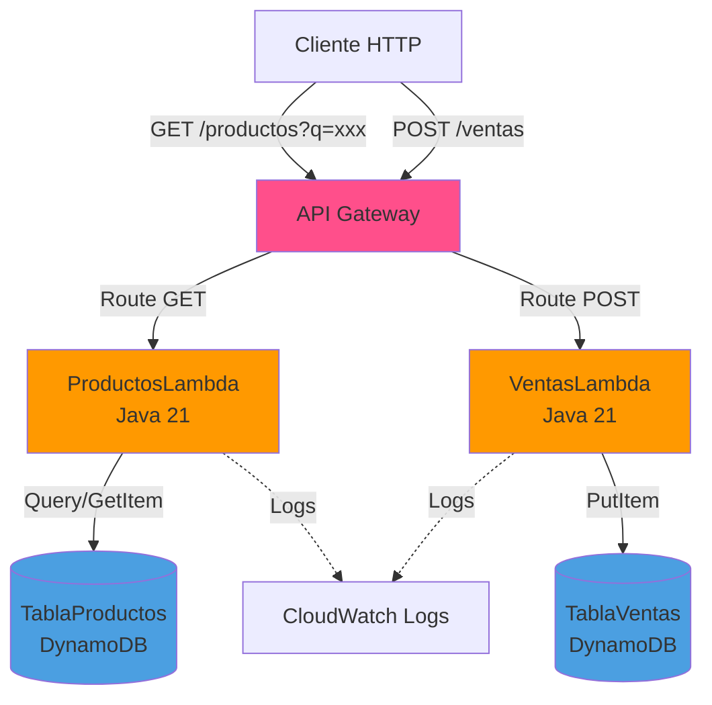
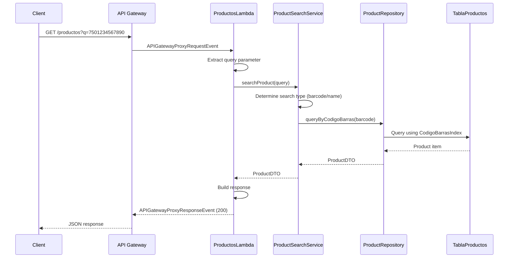
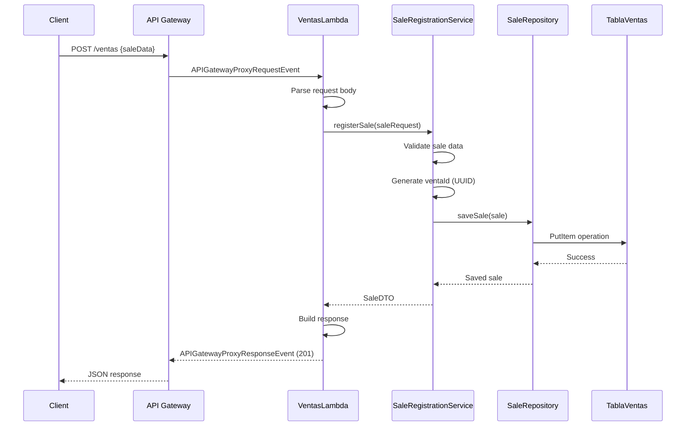

# Design Document: POS Serverless Migration V1

## Overview

Este documento describe el diseño técnico para crear una versión serverless simplificada del sistema POS de supermercado utilizando AWS SAM (Serverless Application Model). La solución migra dos funcionalidades core del sistema Spring Boot existente a una arquitectura serverless: búsqueda de productos y registro de ventas.

### Objetivos del Diseño

1. **Arquitectura Serverless**: Implementar una solución completamente serverless usando AWS Lambda, API Gateway y DynamoDB
2. **Reutilización de Código**: Aprovechar DTOs y lógica de validación del proyecto Spring Boot existente
3. **Simplicidad V1**: Enfocarse en funcionalidad core sin autenticación, integraciones externas ni características avanzadas
4. **Desplegabilidad**: Crear una solución que se pueda desplegar fácilmente usando comandos SAM estándar
5. **Desarrollo Local**: Soportar pruebas locales usando SAM CLI para acelerar el ciclo de desarrollo

### Alcance

**Incluido en V1:**
- Búsqueda de productos por código de barras o nombre
- Registro de ventas con validación básica
- Almacenamiento en DynamoDB
- API REST mediante API Gateway
- Estructura de proyecto Maven multi-módulo
- Soporte para desarrollo y pruebas locales

**Excluido de V1:**
- Autenticación y autorización
- Integración con APIs externas (Product API, Customer API)
- Frontend o interfaz de usuario
- Lógica de retry o circuit breakers
- Tareas programadas o jobs en background
- Funcionalidades avanzadas del POS (descuentos, devoluciones, congelamiento)

### Decisiones de Diseño Clave

1. **Java 21 Runtime**: Usar la versión más reciente de Java soportada por AWS Lambda para aprovechar mejoras de rendimiento y características del lenguaje
2. **AWS SDK v2**: Utilizar la versión 2 del SDK de AWS para mejor rendimiento y API moderna
3. **DynamoDB On-Demand**: Usar billing mode on-demand para escalabilidad automática sin gestión de capacidad
4. **Maven Multi-Módulo**: Estructura de proyecto que permite builds independientes de cada Lambda
5. **Separación de Capas**: Mantener separación clara entre handlers, servicios y acceso a datos para testabilidad

## Architecture

### High-Level Architecture



### Component Interaction Flow

**Búsqueda de Productos:**


**Registro de Ventas:**


### Infrastructure Components

| Component | Type | Purpose | Configuration |
|-----------|------|---------|---------------|
| API Gateway | AWS::Serverless::Api | HTTP endpoint exposure | REST API with CORS enabled |
| ProductosLambda | AWS::Serverless::Function | Product search handler | Java 21, 512MB memory, 30s timeout |
| VentasLambda | AWS::Serverless::Function | Sale registration handler | Java 21, 512MB memory, 30s timeout |
| TablaProductos | AWS::DynamoDB::Table | Product storage | On-demand, PITR enabled, 2 GSIs |
| TablaVentas | AWS::DynamoDB::Table | Sales storage | On-demand, PITR enabled |
| IAM Roles | AWS::IAM::Role | Lambda execution permissions | Least privilege principle |

## Components and Interfaces

### Project Structure

```
sales-api-serverless/
├── template.yaml                    # SAM template (infrastructure as code)
├── pom.xml                          # Root Maven POM (multi-module)
├── productos-lambda/
│   ├── pom.xml                      # Lambda-specific POM
│   └── src/main/java/com/supermarket/sales/serverless/productos/
│       ├── handler/
│       │   └── ProductosHandler.java
│       ├── service/
│       │   └── ProductSearchService.java
│       ├── repository/
│       │   └── ProductRepository.java
│       ├── dto/
│       │   ├── ProductDTO.java      # Reused from Spring Boot project
│       │   └── ErrorResponse.java
│       └── exception/
│           └── ProductNotFoundException.java
└── ventas-lambda/
    ├── pom.xml                      # Lambda-specific POM
    └── src/main/java/com/supermarket/sales/serverless/ventas/
        ├── handler/
        │   └── VentasHandler.java
        ├── service/
        │   └── SaleRegistrationService.java
        ├── repository/
        │   └── SaleRepository.java
        ├── dto/
        │   ├── CreateSaleRequest.java   # Reused from Spring Boot project
        │   ├── SaleDTO.java             # Simplified version
        │   └── ErrorResponse.java
        └── exception/
            └── ValidationException.java
```

### ProductosLambda Components

#### ProductosHandler
**Responsibility**: Lambda entry point for product search requests

```java
public class ProductosHandler implements RequestHandler<APIGatewayProxyRequestEvent, APIGatewayProxyResponseEvent> {
    private final ProductSearchService searchService;
    private final ObjectMapper objectMapper;
    
    @Override
    public APIGatewayProxyResponseEvent handleRequest(APIGatewayProxyRequestEvent input, Context context) {
        // 1. Extract query parameter "q"
        // 2. Validate parameter presence
        // 3. Delegate to ProductSearchService
        // 4. Build APIGatewayProxyResponseEvent
        // 5. Handle exceptions and return appropriate HTTP status
    }
}
```

**Input**: `APIGatewayProxyRequestEvent` with query parameter `q`
**Output**: `APIGatewayProxyResponseEvent` with HTTP status and JSON body

#### ProductSearchService
**Responsibility**: Business logic for product search

```java
public class ProductSearchService {
    private final ProductRepository productRepository;
    
    public ProductDTO searchProduct(String query) {
        // 1. Determine search type (numeric = barcode, alphabetic = name)
        // 2. Call appropriate repository method
        // 3. Return ProductDTO or throw ProductNotFoundException
    }
    
    private boolean isNumeric(String query) {
        // Check if query contains only digits
    }
}
```

**Methods**:
- `searchProduct(String query)`: Main search method that routes to barcode or name search

#### ProductRepository
**Responsibility**: DynamoDB access layer for products

```java
public class ProductRepository {
    private final DynamoDbClient dynamoDbClient;
    private final String tableName;
    
    public ProductDTO queryByCodigoBarras(String codigoBarras) {
        // 1. Build QueryRequest using CodigoBarrasIndex GSI
        // 2. Execute query
        // 3. Map DynamoDB item to ProductDTO
        // 4. Return result or throw ProductNotFoundException
    }
    
    public ProductDTO queryByNombre(String nombre) {
        // 1. Build QueryRequest using NombreIndex GSI
        // 2. Execute query
        // 3. Map DynamoDB item to ProductDTO
        // 4. Return result or throw ProductNotFoundException
    }
}
```

**Dependencies**: AWS SDK v2 DynamoDbClient

### VentasLambda Components

#### VentasHandler
**Responsibility**: Lambda entry point for sale registration requests

```java
public class VentasHandler implements RequestHandler<APIGatewayProxyRequestEvent, APIGatewayProxyResponseEvent> {
    private final SaleRegistrationService registrationService;
    private final ObjectMapper objectMapper;
    
    @Override
    public APIGatewayProxyResponseEvent handleRequest(APIGatewayProxyRequestEvent input, Context context) {
        // 1. Parse request body to CreateSaleRequest
        // 2. Validate request body presence
        // 3. Delegate to SaleRegistrationService
        // 4. Build APIGatewayProxyResponseEvent with 201 status
        // 5. Handle exceptions and return appropriate HTTP status
    }
}
```

**Input**: `APIGatewayProxyRequestEvent` with JSON body
**Output**: `APIGatewayProxyResponseEvent` with HTTP status and JSON body

#### SaleRegistrationService
**Responsibility**: Business logic for sale registration

```java
public class SaleRegistrationService {
    private final SaleRepository saleRepository;
    
    public SaleDTO registerSale(CreateSaleRequest request) {
        // 1. Validate request fields (terminalId, cashierId required)
        // 2. Generate unique ventaId using UUID
        // 3. Create sale object with timestamp
        // 4. Call repository to save
        // 5. Return SaleDTO with generated ID and timestamp
    }
    
    private void validateRequest(CreateSaleRequest request) {
        // Validate required fields are not blank
    }
    
    private String generateVentaId() {
        // Generate UUID-based unique identifier
    }
}
```

**Methods**:
- `registerSale(CreateSaleRequest)`: Main registration method
- `validateRequest(CreateSaleRequest)`: Validation logic
- `generateVentaId()`: ID generation

#### SaleRepository
**Responsibility**: DynamoDB access layer for sales

```java
public class SaleRepository {
    private final DynamoDbClient dynamoDbClient;
    private final String tableName;
    
    public SaleDTO saveSale(SaleDTO sale) {
        // 1. Build PutItemRequest
        // 2. Map SaleDTO to DynamoDB item
        // 3. Execute PutItem operation
        // 4. Return saved SaleDTO
        // 5. Handle DynamoDB exceptions
    }
}
```

**Dependencies**: AWS SDK v2 DynamoDbClient

### Shared Components

#### ErrorResponse DTO
**Purpose**: Consistent error response format

```java
public class ErrorResponse {
    private int statusCode;
    private String message;
    private String timestamp;
    
    // Constructor, getters, setters
}
```

**Usage**: Returned in all error scenarios (400, 404, 500)

### API Contracts

#### GET /productos

**Request**:
```
GET /productos?q=7501234567890
```

**Success Response (200)**:
```json
{
  "id": "101",
  "name": "Coca Cola 2L",
  "barcode": "7501234567890",
  "unitPrice": "28.50"
}
```

**Not Found Response (404)**:
```json
{
  "statusCode": 404,
  "message": "Product not found",
  "timestamp": "2024-01-15T10:30:00Z"
}
```

**Validation Error Response (400)**:
```json
{
  "statusCode": 400,
  "message": "Query parameter 'q' is required",
  "timestamp": "2024-01-15T10:30:00Z"
}
```

#### POST /ventas

**Request**:
```json
{
  "terminalId": "TERM-001",
  "cashierId": "CASH-123",
  "productoId": "101",
  "cantidad": 2,
  "total": "57.00"
}
```

**Success Response (201)**:
```json
{
  "ventaId": "550e8400-e29b-41d4-a716-446655440000",
  "productoId": "101",
  "cantidad": 2,
  "total": "57.00",
  "fecha": "2024-01-15T10:30:00Z"
}
```

**Validation Error Response (400)**:
```json
{
  "statusCode": 400,
  "message": "terminalId is required",
  "timestamp": "2024-01-15T10:30:00Z"
}
```

**Internal Error Response (500)**:
```json
{
  "statusCode": 500,
  "message": "Internal server error",
  "timestamp": "2024-01-15T10:30:00Z"
}
```

## Data Models

### DynamoDB Table Schemas

#### TablaProductos

**Primary Key**:
- Partition Key: `id` (String)

**Attributes**:
| Attribute | Type | Description | Example |
|-----------|------|-------------|---------|
| id | String | Unique product identifier | "101" |
| nombre | String | Product name | "Coca Cola 2L" |
| codigo_barras | String | Product barcode | "7501234567890" |
| precio | String | Unit price (stored as string for precision) | "28.50" |

**Global Secondary Indexes**:

1. **CodigoBarrasIndex**
   - Partition Key: `codigo_barras` (String)
   - Projection: ALL
   - Purpose: Enable fast lookup by barcode

2. **NombreIndex**
   - Partition Key: `nombre` (String)
   - Projection: ALL
   - Purpose: Enable fast lookup by product name

**Configuration**:
- Billing Mode: On-Demand
- Point-in-Time Recovery: Enabled
- Deletion Protection: Disabled (for V1 simplicity)

#### TablaVentas

**Primary Key**:
- Partition Key: `ventaId` (String)

**Attributes**:
| Attribute | Type | Description | Example |
|-----------|------|-------------|---------|
| ventaId | String | Unique sale identifier (UUID) | "550e8400-e29b-41d4-a716-446655440000" |
| productoId | String | Product identifier | "101" |
| cantidad | Number | Quantity sold | 2 |
| total | String | Total amount (stored as string for precision) | "57.00" |
| fecha | String | Sale timestamp (ISO 8601) | "2024-01-15T10:30:00Z" |
| terminalId | String | POS terminal identifier | "TERM-001" |
| cashierId | String | Cashier identifier | "CASH-123" |

**Configuration**:
- Billing Mode: On-Demand
- Point-in-Time Recovery: Enabled
- Deletion Protection: Disabled (for V1 simplicity)

### DTO Mappings

#### ProductDTO (Reused from Spring Boot)

```java
public class ProductDTO {
    private Long id;              // Mapped from DynamoDB String id
    private String name;          // Mapped from DynamoDB nombre
    private String barcode;       // Mapped from DynamoDB codigo_barras
    private BigDecimal unitPrice; // Mapped from DynamoDB precio (String)
    // Note: availableStock and category not used in V1
}
```

**Mapping Logic**:
- DynamoDB `id` (String) → `Long.parseLong(id)`
- DynamoDB `nombre` → `name`
- DynamoDB `codigo_barras` → `barcode`
- DynamoDB `precio` (String) → `new BigDecimal(precio)`

#### SaleDTO (Simplified for V1)

```java
public class SaleDTO {
    private String ventaId;       // UUID generated by service
    private String productoId;    // From request
    private Integer cantidad;     // From request
    private BigDecimal total;     // From request
    private LocalDateTime fecha;  // Generated timestamp
}
```

**Mapping Logic**:
- `ventaId` → UUID.randomUUID().toString()
- `fecha` → LocalDateTime.now(ZoneOffset.UTC)
- `total` (BigDecimal) → Stored as String in DynamoDB

#### CreateSaleRequest (Reused from Spring Boot)

```java
public class CreateSaleRequest {
    private String terminalId;    // Required
    private String cashierId;     // Required
    private Long customerId;      // Optional (not used in V1)
    // Additional fields for V1:
    private String productoId;    // Required
    private Integer cantidad;     // Required
    private BigDecimal total;     // Required
}
```

**Note**: The existing `CreateSaleRequest` will be extended with `productoId`, `cantidad`, and `total` fields for the simplified V1 sale model.

## Error Handling

### Error Categories

| Category | HTTP Status | Description | Example |
|----------|-------------|-------------|---------|
| Validation Error | 400 | Missing or invalid request parameters | Query parameter 'q' is required |
| Not Found | 404 | Resource does not exist | Product not found |
| Internal Error | 500 | Unexpected server error | DynamoDB service unavailable |

### Exception Handling Strategy

#### ProductosLambda Exceptions

```java
try {
    ProductDTO product = searchService.searchProduct(query);
    return buildSuccessResponse(200, product);
} catch (IllegalArgumentException e) {
    // Missing or invalid query parameter
    return buildErrorResponse(400, e.getMessage());
} catch (ProductNotFoundException e) {
    // Product not found in DynamoDB
    return buildErrorResponse(404, "Product not found");
} catch (Exception e) {
    // Unexpected error (DynamoDB exception, etc.)
    logger.error("Unexpected error", e);
    return buildErrorResponse(500, "Internal server error");
}
```

#### VentasLambda Exceptions

```java
try {
    CreateSaleRequest request = parseRequest(input.getBody());
    SaleDTO sale = registrationService.registerSale(request);
    return buildSuccessResponse(201, sale);
} catch (JsonProcessingException e) {
    // Invalid JSON in request body
    return buildErrorResponse(400, "Invalid request body");
} catch (ValidationException e) {
    // Missing required fields
    return buildErrorResponse(400, e.getMessage());
} catch (DynamoDbException e) {
    // DynamoDB write failure
    logger.error("DynamoDB error", e);
    return buildErrorResponse(500, "Failed to save sale");
} catch (Exception e) {
    // Unexpected error
    logger.error("Unexpected error", e);
    return buildErrorResponse(500, "Internal server error");
}
```

### Logging Strategy

**Log Levels**:
- **INFO**: Request received, response sent, successful operations
- **ERROR**: Exceptions, DynamoDB failures, unexpected errors

**Log Format**:
```
[RequestId: xxx] [Operation: searchProduct] [Query: 7501234567890] Product found: id=101
[RequestId: xxx] [Operation: registerSale] [VentaId: xxx] Sale registered successfully
[RequestId: xxx] [Operation: searchProduct] ERROR: Product not found for query: xxx
```

**CloudWatch Integration**:
- Logs automatically sent to CloudWatch Logs by Lambda runtime
- Log group: `/aws/lambda/ProductosLambda` and `/aws/lambda/VentasLambda`
- Retention: 7 days (configured in SAM template)

### Error Response Format

All error responses follow this consistent structure:

```json
{
  "statusCode": 400,
  "message": "Descriptive error message",
  "timestamp": "2024-01-15T10:30:00Z"
}
```

**Security Considerations**:
- Never expose stack traces in error responses
- Never expose DynamoDB table names or AWS resource ARNs
- Log detailed error information to CloudWatch for debugging
- Return generic "Internal server error" for unexpected exceptions

## Testing Strategy

### Testing Approach for Serverless Infrastructure

This project involves Infrastructure as Code (IaC) using AWS SAM, Lambda functions, and DynamoDB integration. Property-based testing is **not applicable** for this type of project. Instead, we will use:

1. **Unit Tests**: Test business logic in service and repository layers
2. **Integration Tests**: Test Lambda handlers with local DynamoDB
3. **SAM Local Testing**: Test complete API flows using `sam local start-api`
4. **Deployment Validation**: Verify deployed infrastructure using AWS CLI

### Unit Testing

**Scope**: Service layer and repository layer in isolation

**ProductSearchService Tests**:
```java
@Test
void searchProduct_withNumericQuery_shouldSearchByBarcode() {
    // Given: numeric query
    // When: searchProduct called
    // Then: repository.queryByCodigoBarras should be called
}

@Test
void searchProduct_withAlphabeticQuery_shouldSearchByName() {
    // Given: alphabetic query
    // When: searchProduct called
    // Then: repository.queryByNombre should be called
}

@Test
void searchProduct_whenNotFound_shouldThrowException() {
    // Given: repository returns empty
    // When: searchProduct called
    // Then: ProductNotFoundException thrown
}
```

**SaleRegistrationService Tests**:
```java
@Test
void registerSale_withValidRequest_shouldGenerateVentaId() {
    // Given: valid CreateSaleRequest
    // When: registerSale called
    // Then: ventaId should be UUID format
}

@Test
void registerSale_withMissingTerminalId_shouldThrowValidationException() {
    // Given: request with null terminalId
    // When: registerSale called
    // Then: ValidationException thrown
}

@Test
void registerSale_shouldSetCurrentTimestamp() {
    // Given: valid request
    // When: registerSale called
    // Then: fecha should be current UTC time
}
```

**Mocking Strategy**:
- Mock `ProductRepository` in `ProductSearchService` tests
- Mock `SaleRepository` in `SaleRegistrationService` tests
- Use Mockito for mocking
- No AWS SDK mocking in unit tests (test logic only)

### Integration Testing

**Scope**: Lambda handlers with DynamoDB Local

**Setup**:
- Use DynamoDB Local Docker container
- Create tables with same schema as production
- Seed test data before each test
- Clean up after each test

**ProductosHandler Integration Tests**:
```java
@Test
void handleRequest_withValidBarcode_shouldReturn200() {
    // Given: product exists in DynamoDB Local
    // When: handler receives GET request with barcode
    // Then: response status 200, body contains product
}

@Test
void handleRequest_withInvalidQuery_shouldReturn404() {
    // Given: product does not exist
    // When: handler receives GET request
    // Then: response status 404, body contains error
}

@Test
void handleRequest_withMissingQueryParam_shouldReturn400() {
    // Given: no query parameter
    // When: handler receives GET request
    // Then: response status 400, body contains validation error
}
```

**VentasHandler Integration Tests**:
```java
@Test
void handleRequest_withValidSale_shouldReturn201() {
    // Given: valid sale request body
    // When: handler receives POST request
    // Then: response status 201, sale saved in DynamoDB
}

@Test
void handleRequest_withInvalidBody_shouldReturn400() {
    // Given: invalid JSON body
    // When: handler receives POST request
    // Then: response status 400, body contains error
}
```

**Test Data Management**:
- Create test fixtures for products and sales
- Use consistent test data across tests
- Verify data in DynamoDB after write operations

### SAM Local Testing

**Scope**: End-to-end API testing using SAM CLI

**Test Scenarios**:

1. **Product Search by Barcode**:
```bash
curl "http://localhost:3000/productos?q=7501234567890"
# Expected: 200 OK with product JSON
```

2. **Product Search by Name**:
```bash
curl "http://localhost:3000/productos?q=Coca"
# Expected: 200 OK with product JSON
```

3. **Product Not Found**:
```bash
curl "http://localhost:3000/productos?q=99999"
# Expected: 404 Not Found with error JSON
```

4. **Sale Registration**:
```bash
curl -X POST http://localhost:3000/ventas \
  -H "Content-Type: application/json" \
  -d '{"terminalId":"TERM-001","cashierId":"CASH-123","productoId":"101","cantidad":2,"total":"57.00"}'
# Expected: 201 Created with sale JSON
```

5. **Invalid Sale Request**:
```bash
curl -X POST http://localhost:3000/ventas \
  -H "Content-Type: application/json" \
  -d '{"cashierId":"CASH-123"}'
# Expected: 400 Bad Request with validation error
```

**Prerequisites**:
- Run `sam build` before testing
- Start DynamoDB Local on port 8000
- Seed test data in DynamoDB Local
- Start API with `sam local start-api`

### Deployment Validation

**Scope**: Verify deployed infrastructure in AWS

**Validation Steps**:

1. **Verify Stack Creation**:
```bash
aws cloudformation describe-stacks --stack-name sales-api-serverless
# Expected: Stack status CREATE_COMPLETE
```

2. **Verify Lambda Functions**:
```bash
aws lambda list-functions --query "Functions[?starts_with(FunctionName, 'sales-api-serverless')]"
# Expected: ProductosLambda and VentasLambda listed
```

3. **Verify DynamoDB Tables**:
```bash
aws dynamodb list-tables
# Expected: TablaProductos and TablaVentas listed
```

4. **Verify API Gateway**:
```bash
aws apigateway get-rest-apis
# Expected: sales-api-serverless API listed
```

5. **Test Deployed Endpoints**:
```bash
# Get API URL from stack outputs
API_URL=$(aws cloudformation describe-stacks --stack-name sales-api-serverless \
  --query "Stacks[0].Outputs[?OutputKey=='ProductosApiUrl'].OutputValue" --output text)

# Test product search
curl "$API_URL?q=test"
```

### Test Coverage Goals

| Component | Target Coverage | Focus Areas |
|-----------|----------------|-------------|
| Service Layer | 90%+ | Business logic, validation, error handling |
| Repository Layer | 80%+ | DynamoDB operations, mapping logic |
| Handler Layer | 70%+ | Request parsing, response building, exception handling |

### Testing Tools

- **JUnit 5**: Test framework
- **Mockito**: Mocking framework for unit tests
- **AssertJ**: Fluent assertions
- **DynamoDB Local**: Local DynamoDB for integration tests
- **SAM CLI**: Local API testing
- **AWS CLI**: Deployment validation

### Continuous Testing

**Development Workflow**:
1. Write unit tests for new service methods
2. Run unit tests: `mvn test`
3. Write integration tests for handlers
4. Run integration tests: `mvn verify` (with DynamoDB Local)
5. Test locally: `sam build && sam local start-api`
6. Manual API testing with curl or Postman
7. Deploy to AWS: `sam deploy`
8. Run deployment validation scripts

**CI/CD Considerations** (Future):
- Run unit tests on every commit
- Run integration tests on pull requests
- Deploy to staging environment automatically
- Run smoke tests against staging
- Manual approval for production deployment

